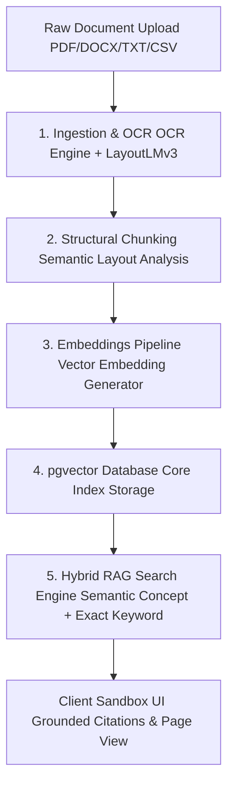

# DocuSense AI — Enterprise Document Intelligence & Reasoning

DocuSense AI is a next-generation enterprise document intelligence platform engineered for legal, financial, and technical teams. Unlike generic chat interfaces, DocuSense AI provides zero-hallucination grounded Q&A, page-level citation auditing, side-by-side contract comparison (redline diffs), and schema-based structured metadata extraction.

---

## 🚀 Key Features

*   **Grounded RAG & Citations:** Query document collections with natural language. Every answer includes precise, clickable page-level citations mapping back to exact source text blocks.
*   **Asymmetrical Bento Capabilities Grid:** Modern, premium interactive showcase featuring Vector Retrieval terminals, live JSON schema editors, and firewall safety logs.
*   **Side-by-Side Contract Comparison:** Select multiple document drafts to automatically compare clauses, notice periods, and liability caps with a built-in redline diff viewer.
*   **Pipeline Upload Ingestion:** Interactive drag-and-drop document pipeline showing real-time extraction stages (`OCR Ingestion` ➔ `NLP Layout Parsing` ➔ `Vector Chunking` ➔ `Grounded Index Ready`).
*   **Hybrid Semantic Search:** pgvector-powered sub-second search with instant toggle between Concept Semantic Match (with relevance scoring %) and Exact Keyword search.

---

## 🛠️ Technology Stack

*   **Frontend Framework:** Next.js (App Router) + React 19
*   **Styling & Motion:** Tailwind CSS + Motion (Framer Motion)
*   **Icons:** Lucide React
*   **Development & Build Tooling:** npm, TypeScript, PostCSS
*   **E2E Testing Suite:** Playwright (Chromium, Firefox, WebKit)

---

## ⚡ Getting Started

### Prerequisites
Make sure you have Node.js (v18.x or higher) installed.

### Installation
1. Clone the repository and navigate to the project directory:
   ```bash
   git clone <your-repository-url>
   cd serene-noether
   ```

2. Install dependencies:
   ```bash
   npm install
   ```

### Running Locally
Run the Next.js development server:
```bash
npm run dev
```
Open [http://localhost:3000](http://localhost:3000) to view the application.

### Running End-to-End Tests
Execute the comprehensive Playwright test suite:
```bash
# Headless test run (Recommended)
npm run test

# Run tests in UI mode
npm run test:ui
```

---

## 📐 System Architecture

DocuSense AI uses a 5-layer ingestion and retrieval pipeline:



---

## 📄 License
This project is licensed under the ISC License.
