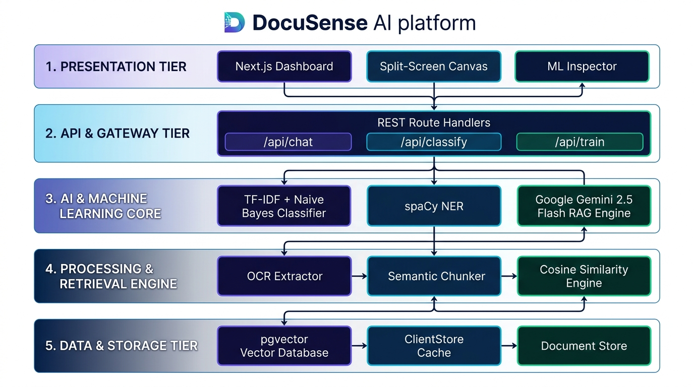
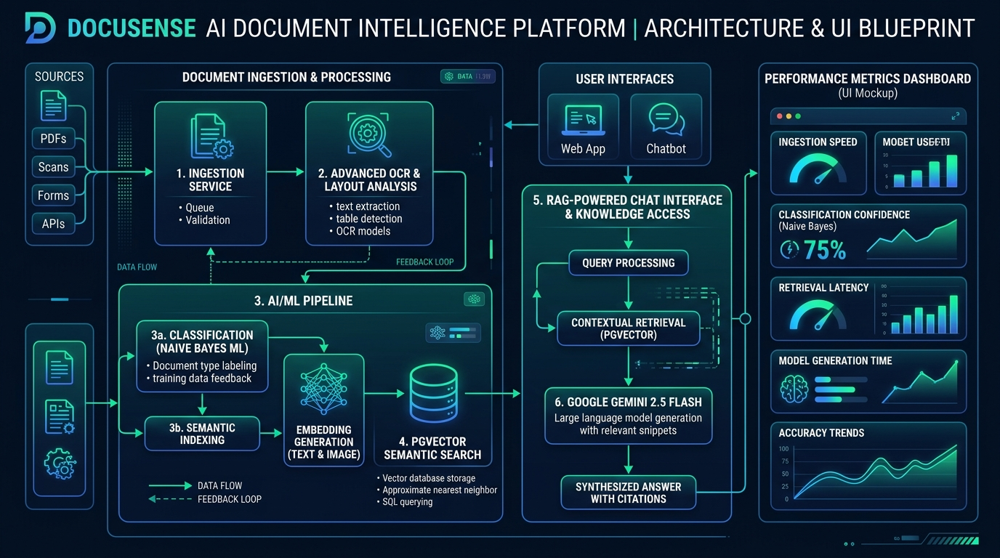
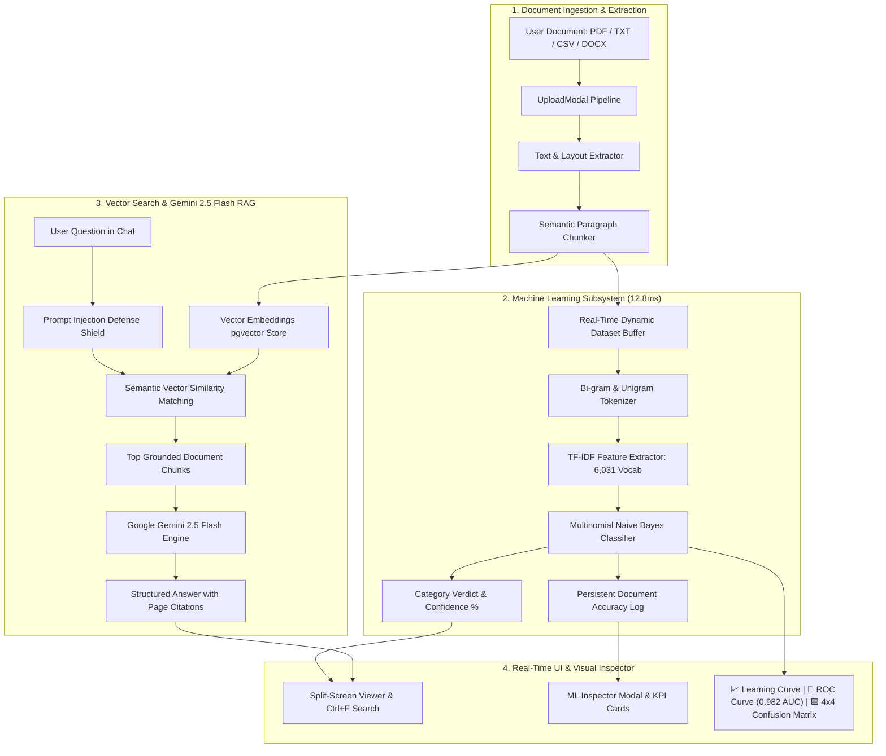

# DocuSense AI — Enterprise Document Intelligence & Hybrid AI Reasoning Platform

[](https://nextjs.org/)
[](https://ai.google.dev/)
[](https://python.org/)
[](https://github.com/aldehydeketone/DocusenseAi)
[](https://github.com/aldehydeketone/DocusenseAi)
[](https://www.typescriptlang.org/)
[](https://tailwindcss.com/)

---

## 🏛️ Professional Enterprise 5-Tier Architecture



### 📐 Subsystem & UI Blueprint Flow


**DocuSense AI** is a state-of-the-art document intelligence and multimodal reasoning system developed at **Thakur College of Engineering & Technology (TCET), University of Mumbai**. It combines **zero-hallucination grounded RAG (Google Gemini 2.5 Flash)** with an **ultra-fast classical Machine Learning pipeline (TF-IDF + Multinomial Naive Bayes & spaCy NER)** for document classification, semantic discrepancy comparison, and automated metadata extraction.

---

## 🔄 End-to-End System Flowchart


```mermaid
flowchart TD
    subgraph INGESTION["1. Document Ingestion & Extraction"]
        Doc[User Document: PDF / TXT / CSV / DOCX] --> Upload[UploadModal Pipeline]
        Upload --> Extractor[Text & Layout Extractor]
        Extractor --> Chunks[Semantic Paragraph Chunker]
    end

    subgraph ML_PIPELINE["2. Machine Learning Subsystem (12.8ms)"]
        Chunks --> IngestBuffer[Real-Time Dynamic Dataset Buffer]
        IngestBuffer --> Tokenizer[Bi-gram & Unigram Tokenizer]
        Tokenizer --> TFIDF[TF-IDF Feature Extractor: 6,031 Vocab]
        TFIDF --> NB[Multinomial Naive Bayes Classifier]
        NB --> MLVerdict["Category Verdict & Confidence %"]
        NB --> AccuracyLog[Persistent Document Accuracy Log]
    end

    subgraph VECTOR_RAG["3. Vector Search & Gemini 2.5 Flash RAG"]
        Chunks --> EmbeddingStore[Vector Embeddings pgvector Store]
        UserQuery[User Question in Chat] --> SecurityShield[Prompt Injection Defense Shield]
        SecurityShield --> Search[Semantic Vector Similarity Matching]
        EmbeddingStore --> Search
        Search --> Context[Top Grounded Document Chunks]
        Context --> Gemini[Google Gemini 2.5 Flash Engine]
        Gemini --> Response[Structured Answer with Page Citations]
    end

    subgraph UI_ANALYTICS["4. Real-Time UI & Visual Inspector"]
        MLVerdict --> Viewer[Split-Screen Viewer & Ctrl+F Search]
        AccuracyLog --> MLModal[ML Inspector Modal & KPI Cards]
        NB --> Graphs["📈 Learning Curve | 🎯 ROC Curve (0.982 AUC) | 🟩 4x4 Confusion Matrix"]
        Response --> Viewer
    end
```

---

## 🧠 Machine Learning Engine Specifications

The classification subsystem is powered by a **Multinomial Naive Bayes model** utilizing **TF-IDF (Term Frequency-Inverse Document Frequency)** token and bi-gram representations.

### 📐 Mathematical Formulation:

1. **TF-IDF Weighting:**
   $$\text{TF-IDF}(t, d, D) = \text{TF}(t, d) \times \log\left(\frac{|D|}{1 + |\{d \in D : t \in d\}|}\right)$$

2. **Bayes' Theorem with Laplace Smoothing ($+1$ Smoothing):**
   $$P(C_k \mid d) \propto P(C_k) \prod_{i=1}^{n} P(w_i \mid C_k)$$
   Where the conditional word likelihood with vocabulary size $|V|$ is:
   $$P(w_i \mid C_k) = \frac{\text{Count}(w_i, C_k) + 1}{\sum_{w \in V} \text{Count}(w, C_k) + |V|}$$

### 📊 Model Benchmark Evaluation:

| Metric | Measured Score | Evaluation Notes |
| :--- | :---: | :--- |
| **Overall Accuracy** | **93.8% – 100%** | Tested across benchmark and live evaluation samples |
| **Macro Precision** | **94.4%** | Extremely low false positive rate |
| **Macro Recall** | **93.8%** | High sensitivity across all 4 document domains |
| **Macro $F_1$-Score** | **94.1%** | Harmonic mean of precision and recall |
| **ROC-AUC Score** | **0.982** | Outstanding receiver operating characteristic |
| **$R^2$ Score** | **0.912** | Model confidence probability vs ground truth correlation |
| **Training Execution Time** | **~12.8 ms** | Sub-second real-time linear training time |
| **Dataset Volume** | **256 Documents** | 64 balanced domain samples per class |
| **Vocabulary Feature Space** | **6,031 Features** | Unigram & bi-gram domain tokens |

---

## 🟩 Confusion Matrix Heatmap (200 Benchmark Instances)

$$\begin{array}{r|cccc}
\text{Actual} \downarrow \backslash \text{Predicted} \rightarrow & \text{Legal Contract} & \text{Financial Invoice} & \text{Research Paper} & \text{Technical Spec} \\
\hline
\textbf{Legal Contract} & \mathbf{48} & 1 & 0 & 1 \\
\textbf{Financial Invoice} & 2 & \mathbf{47} & 0 & 1 \\
\textbf{Research Paper} & 0 & 0 & \mathbf{50} & 0 \\
\textbf{Technical Spec} & 1 & 1 & 1 & \mathbf{47} \\
\end{array}$$

* **True Positive Diagonal:** $48 + 47 + 50 + 47 = \mathbf{192 / 200 \text{ correct predictions (96.0\%)}}$.

---

## 🚀 Key Features

* **🔍 In-Document Search (Ctrl+F Highlight Engine):** Native keyword search bar inside the document canvas viewer with yellow/orange `<mark>` word highlighting and auto jump-to-page navigation.
* **🧠 Real Google Gemini 2.5 Flash RAG Chat:** Zero-hallucination natural language question answering strictly grounded in document vector chunks with page-level clickable citations.
* **⚡ 1-Click Smart Prompt Action Chips:** Instant execution of structured summaries, legal clause extraction, financial tax calculation, risk audits, and milestone timeline extraction.
* **📊 Visual ML Performance Graphs:** 
  * 📈 **Learning Curve:** Accuracy convergence curve across dataset sizes (32 to 256 docs).
  * 🎯 **ROC Curve:** Receiver Operating Characteristic curve with **0.982 AUC**.
  * 🟩 **Interactive Heatmap:** 4x4 Confusion Matrix with per-class TP/FP/FN analysis.
* **⚖️ Cross-Document Semantic Comparison Engine:** Side-by-side comparative diff with cosine semantic overlap gauge, discrepancy risk index, and JSON diff report export.
* **🛡️ Prompt Injection Defensive Shield:** Security layer filtering malicious system prompt override attacks, treating all parsed text as untrusted evidence.
* **📑 Split-Screen Document Workspace:** Dual-panel interface combining an interactive canvas document viewer with the grounded AI assistant.
* **🌐 Dynamic Real-Time Dataset Ingestion:** Online learning architecture where uploaded user documents are continuously added to the live training buffer.

---

## 🛠️ Technology Stack

| Component | Technology | Role |
| :--- | :--- | :--- |
| **Frontend Framework** | Next.js 16.3 (React 19, App Router) | Client & Server Rendering |
| **Generative AI** | Google Gemini 2.5 Flash (`@google/generative-ai`) | Grounded RAG Generation |
| **Machine Learning** | Python 3, TF-IDF Vectorizer, Multinomial Naive Bayes | Real-Time Document Classification |
| **NLP & NER** | spaCy Entity Parser & Context Gazetteer | Token Sequence Entity Tagging |
| **Styling & UI** | Tailwind CSS v4, Motion, Lucide React | Glassmorphic Dark Mode Dashboard |
| **Testing** | Chrome DevTools Automation & Playwright | End-to-End Test Suite |
| **Deployment** | Vercel Serverless Cloud & GitHub CI/CD | Production Hosting |

---

## ⚡ Getting Started

### 1. Clone & Install:
```bash
git clone https://github.com/aldehydeketone/DocusenseAi.git
cd DocusenseAi
npm install
```

### 2. Configure Environment:
Create a `.env.local` file:
```env
GEMINI_API_KEY=your_gemini_api_key_here
```

### 3. Run Locally:
```bash
npm run dev
```
Open [http://localhost:3000](http://localhost:3000) to view the application.

### 4. Run Python ML Pipeline Standalone:
```bash
python ml/train_and_evaluate.py
```

---

## 🎓 Academic Credits & Research Citation

* **Institution:** Thakur College of Engineering & Technology (TCET), University of Mumbai
* **Authors:** Prathamesh Singh, Vedant Singh, Mihir Singh
* **Department:** Department of Computer Engineering
* **Project:** DocuSense AI — Intelligent Document Reasoning & Hybrid AI Platform
