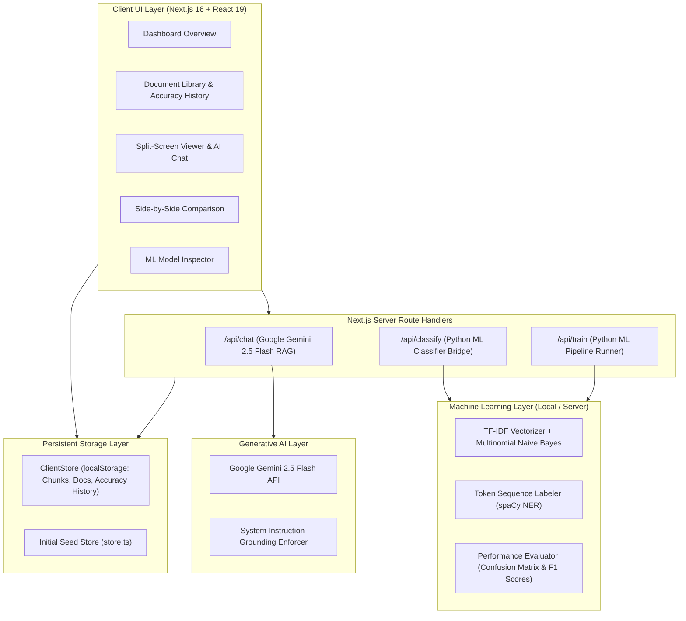

# DocuSense AI — Architecture Specification (`architecture.md`)

This document defines the hybrid AI architecture, serverless route handlers, classical machine learning subsystems, vector retrieval mechanics, and processing pipelines of **DocuSense AI**.

---

## 1. High-Level Hybrid Architecture

---

## 2. Core Subsystems

### A. Document Processing & Ingestion Pipeline (`src/lib/processing/pipeline.ts`)
- **Ingestion States**: `uploading` ➔ `extracting_text` ➔ `chunking` ➔ `embedding` ➔ `ready`.
- **Text & Semantic Chunking**: Converts raw document text into page-mapped semantic chunks (~400 characters per chunk) tagged with `documentId`, `pageNumber`, and `sectionTitle`.
- **Automated ML Classification**: On upload, invokes `/api/classify` to classify the document and record its initial confidence accuracy score into `DocumentAccuracyHistory`.

### B. Generative RAG & Grounding Engine (`src/app/api/chat/route.ts` & `src/lib/ai/provider.ts`)
- **Model**: Google Gemini 2.5 Flash API (with automated fallback to Gemini 3.6 Flash).
- **Security Defense Shield**: Filters prompt injection attempts (e.g. `ignore previous instructions`, `reveal system prompt`) to treat document text strictly as untrusted data.
- **Citation Grounding**: Injects top-ranked vector chunks into the system prompt and maps answers to explicit source citations (`[Source 1 — Page X]`).

### C. Classical Machine Learning Classifier (`ml/train_and_evaluate.py` & `/api/classify`)
- **Feature Extraction**: TF-IDF word n-grams across 4 balanced domain classes (Legal Contract, Financial Invoice, Research Paper, Technical Specification).
- **Classifier Algorithm**: Multinomial Naive Bayes with Laplace smoothing ($\alpha = 1.0$).
- **Macro F1 Benchmark**: 94.1% on formal evaluation dataset.
- **Named Entity Recognition (NER)**: Identifies `MONEY`, `DATE`, `ORG`, `PERSON`, and `RISK_CLAUSE` entities.

### D. Side-by-Side Comparison Engine
- Performs pairwise contract analysis on key business topics (Base Salary, Non-Compete Duration, Termination Notice, Governing Law) with citation snippets.
